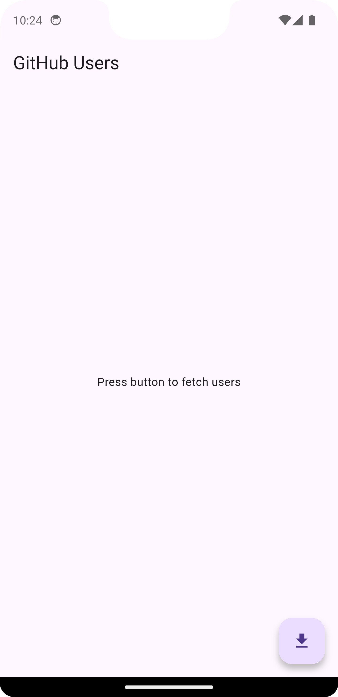
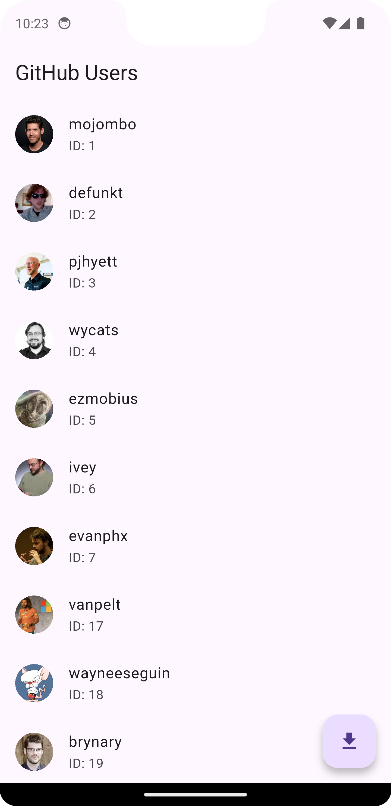

# 📋 Flutter ListView UI with Bloc

A Flutter project that demonstrates a clean implementation of **MVVM architecture**, **Bloc for state management**, and **Dio for networking**, fetching and displaying a list of users from the public GitHub API.

---

## 🚀 Features

- MVVM pattern with clear separation of concerns
- `flutter_bloc` for scalable state management
- `dio` for robust API calls
- Displays GitHub user list with avatar, username, and ID
- Error handling and loading indicators
- Clean, modular project structure

---

## 📸 Screenshots

  
  

---

## 🚧 Note

> This project focuses on the **UI and state management layer only**.  
No API or database integration is included—**user data is mocked locally** for demonstration purposes.

---
